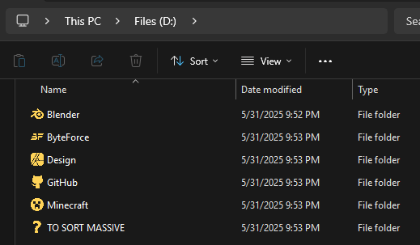

# Windows FS Icons

A clean, modern icon library for your Windows filesystem, designed in Affinity Designer and powered by Rust.

This project includes:
- SVG icons for popular apps and folders
- A Rust CLI that converts SVG → PNG → ICO
- Clean, square, 256x256 .ico files ready to be applied on Windows

👉 Blog post: https://bylazar.com/blog/windows-fs-icons

---

## Usage
- Place your SVG files in ./data/SVG
- Run the converter:

```sh
cargo run --release
```

This will:
- Render each SVG to a 256×256 PNG with transparent padding and new color
- Convert the PNG to an ICO file
- Output all icons to ./data/ICO